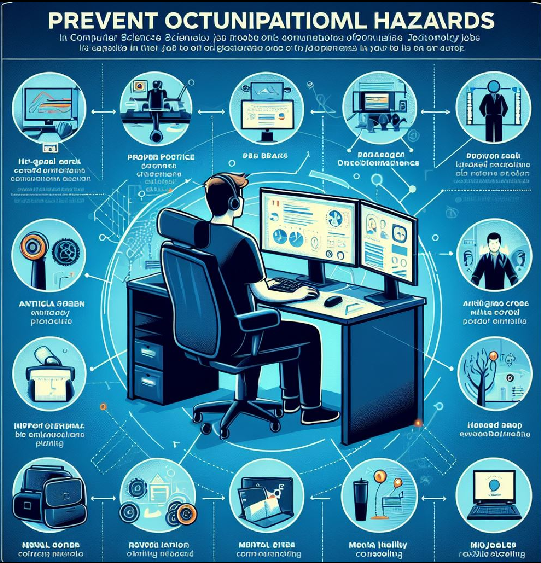

# Prevención de Riesgos Laborales en Informática:

## Los principales riesgos laborales que experimentan los trabajadores informáticos son:

   - Fatiga visual o muscular
   - Golpes o caídas
   - Contacto eléctrico
   - Carga mental
   - Distintos factores en la organización

